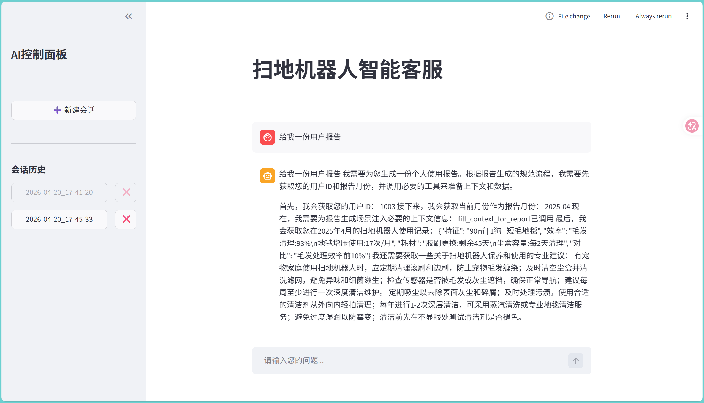
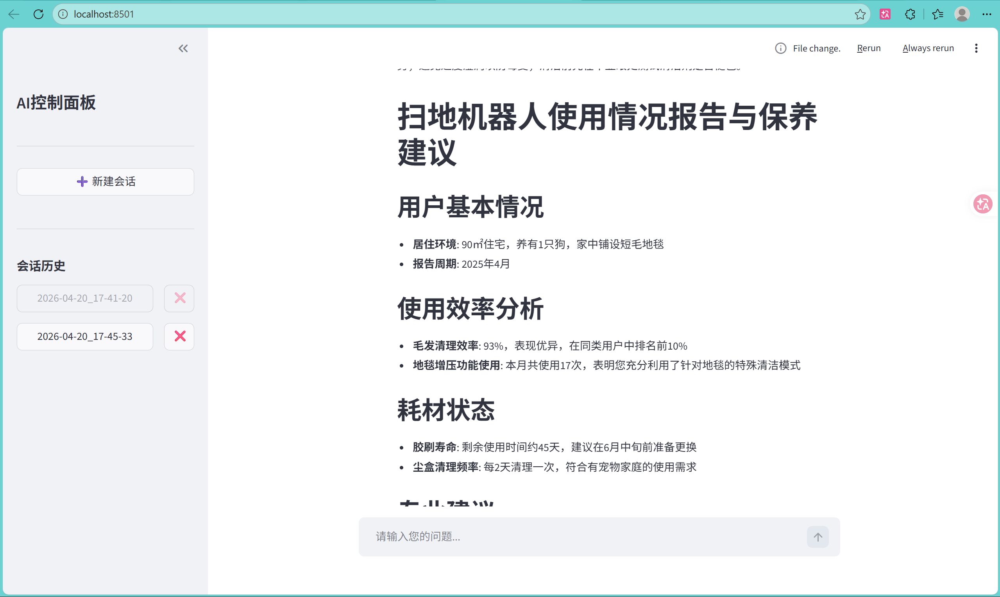
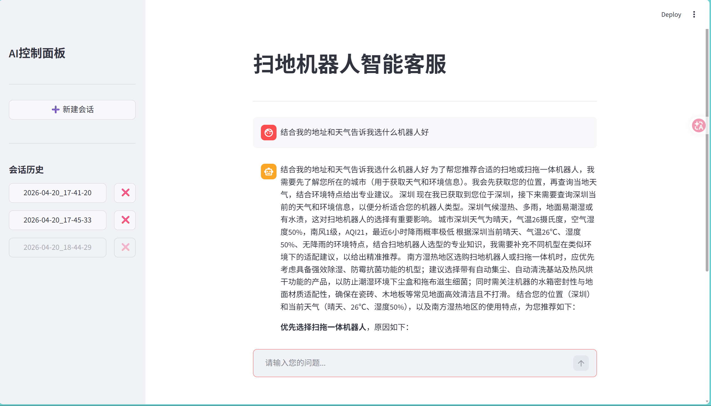

# Agent-RAG

<div align="center">
  <!-- Python版本（项目核心运行环境） -->
  
  <!-- Streamlit（前端交互框架） -->
  
  <!-- LangChain（RAG流程核心） -->
  
  <!-- ChromaDB（向量数据库） -->
  
  <!-- 通义千问（大模型对接） -->
  
  <!-- 新增：YAML（配置文件格式），贴合config目录的yml文件 -->
  
  <!-- 新增：SQLite（ChromaDB底层存储），贴合chroma.sqlite3文件 -->
  
</div>

<br>

一款基于 Streamlit + RAG 构建的交互式智能客服系统，专为扫地机器人场景设计，支持多会话管理、流式响应输出，具备灵活的会话创建/切换/删除能力。

## 🌟 核心特性
- 基于 RAG（检索增强生成）技术，精准匹配扫地机器人相关知识库（支持 PDF/TXT 等格式）
- Streamlit 可视化交互界面，支持多会话独立管理（创建/切换/删除）
- 流式响应输出，提升对话交互体验
- 灵活的配置化管理（Agent/Chroma/RAG/Prompt 均可通过 YAML 配置）
- 基于 Chroma DB 实现本地向量存储，保障数据隐私

## ▶️ 运行示例




## 📋 环境准备
### 1. 依赖安装
```bash
pip install -r requirements.txt  # 需补充项目依赖清单，示例核心依赖：
# streamlit
# chromadb
# langchain
# pypdf
# python-dotenv
# PyYAML
```
### 2.配置文件说明
项目核心配置均存放于 config/ 目录：  
agent.ymll：智能体（Agent）行为配置（如思考逻辑、工具调用规则）   
{insert\_element\_1\_LSBgY2hyb21hLnlt}l：Chroma 向量数据库配置（存储路径、嵌入模型、相似度阈值）  
prompts.ymll：对话提示词模板（系统提示、用户问题引导等）   
{insert\_element\_3\_LSBgcmFnLnlt}l：RAG 流程配置（检索策略、上下文拼接规则、召回数量）  

## 🚀 快速启动
```bash
# 运行 Streamlit 应用
streamlit run app.py
```
## 📁 项目结构
```plaintext
Agent-RAG/
├── .gitignore                  # Git忽略规则文件
├── LICENSE                     # 开源许可证文件
├── README.md                   # 项目核心说明文档
├── app.py                      # Streamlit应用主入口（Python文件）
├── md5.text                    # MD5校验相关文本文件
├── chroma_db/                  # Chroma向量库持久化目录
│   └── chroma.sqlite3          # Chroma数据库文件（SQLite）
├── config/                     # 项目配置目录
│   ├── agent.yml               # Agent智能体配置文件（YAML）
│   ├── chroma.yml              # Chroma向量库配置文件（YAML）
│   ├── prompts.yml             # 提示词模板配置文件（YAML）
│   └── rag.yml                 # RAG流程配置文件（YAML）
├── rag/                        # RAG核心逻辑目录
│   ├── __pycache__/            # Python编译缓存目录
│   ├── chroma_db/              # RAG模块内Chroma相关子目录
│   ├── rag_service.py          # RAG服务核心实现（Python文件）
│   └── vector_store.py         # 向量存储操作逻辑（Python文件）
├── model/                      # 大模型对接逻辑目录
│   ├── __pycache__/            # Python编译缓存目录
│   └── factory.py              # 模型工厂（多模型适配）（Python文件）
├── logs/                       # 日志输出目录
│   ├── agent_20260125.log      # 2026-01-25 Agent运行日志
│   ├── agent_20260126.log      # 2026-01-26 Agent运行日志
│   └── agent_20260420.log      # 2026-04-20 Agent运行日志
├── data/                       # 知识库数据目录
│   └── external/               # 外部知识库文件目录
│       ├── 扫地机器人100问.pdf     # 扫地机器人知识库（PDF）
│       ├── 扫地机器人100问2.txt    # 扫地机器人知识库（TXT）
│       ├── 扫拖一体机器人100问.txt  # 扫拖一体机器人知识库（TXT）
│       ├── 故障排除.txt            # 故障排除知识库（TXT）
│       ├── 维护保养.txt            # 维护保养知识库（TXT）
│       └── 选购指南.txt            # 选购指南知识库（TXT）
├── agent/                      # Agent智能体核心目录（省略子文件）
├── .idea/                      # IDE配置目录（省略子文件）
└── prompts/                    # 提示词模板文件目录（省略子文件）
```

## 📖 使用说明
1.将扫地机器人相关知识库文档（PDF/TXT）放入 data/external/ 目录  
2.调整 config/ 下的配置文件（按需修改向量库、RAG 策略、Agent 规则）  
3.启动应用后，在网页端即可进行多会话问答，支持切换 / 删除会话  
4.系统会自动检索知识库，结合大模型生成精准回答  
